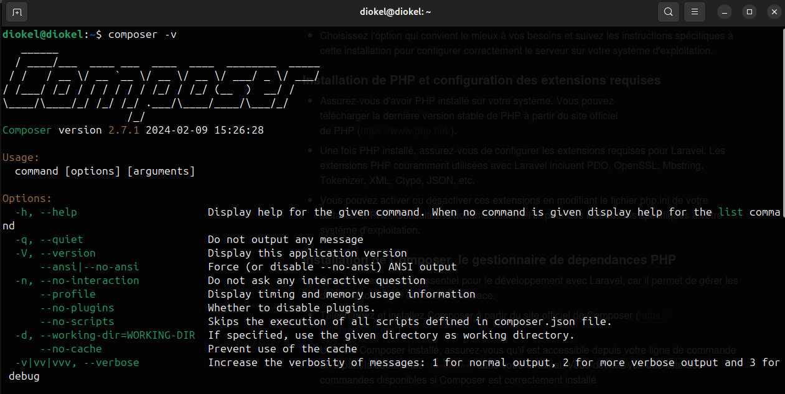

# Développement Web avec Laravel

## Introduction

### Définition:
Laravel est un framework PHP open-source qui permet de développer rapidement des applications web robustes et évolutives. Il adopte une approche élégante et expressive du développement web et offre aux développeurs une vaste gamme de fonctionnalités pour simplifier et accélérer le processus de développement.

### Définition de Laravel
Laravel a été créé par Taylor Otwell et a été publié pour la première fois en 2011. Depuis lors, il a connu une croissance exponentielle de sa popularité grâce à sa simplicité d'utilisation, sa documentation exhaustive et ses fonctionnalités puissantes.

Au fil des ans, Laravel a connu plusieurs versions majeures, introduisant régulièrement de nouvelles fonctionnalités et améliorations. Chaque nouvelle version améliore la facilité d'utilisation, la sécurité et les performances du framework, tout en restant fidèle à sa philosophie de simplicité et d'expressivité.

## Caractéristiques principales de Laravel
- Architecture MVC (Modèle-Vue-Contrôleur)
Laravel adopte  l’architecture MVC qui permet de séparer clairement les différentes composantes d'une application web. Cette séparation des préoccupations facilite la maintenance, l'extension et la collaboration entre les développeurs. 

1. Les modèles représentent les données de l'application
2. les vues gèrent l'interface utilisateur
3. les contrôleurs orchestrent les interactions entre les modèles et les vues


- Eloquent ORM
Laravel est livré avec Eloquent, un ORM (Object-Relational Mapping) puissant et intuitif qui simplifie la manipulation des données dans la base de données. Grâce à Eloquent, les développeurs peuvent interagir avec la base de données en utilisant des modèles PHP plutôt que des requêtes SQL directes, ce qui rend le code plus lisible, plus maintenable et moins sujet aux erreurs.

- Système de routage flexible et intuitif
Laravel offre un système de routage flexible qui permet de définir facilement des points d'entrée pour les différentes actions de l'application. Les routes peuvent être définies de manière claire et intuitive, permettant de mapper les URI aux actions des contrôleurs de manière simple et cohérente.

- Moteur de template Blade

- Nombreuses fonctionnalités intégrées
Laravel est livré avec de nombreuses fonctionnalités intégrées telles que l'authentification, la validation, la gestion des sessions, la mise en cache, etc. Ces fonctionnalités prêtes à l'emploi permettent aux développeurs de se concentrer sur le développement des fonctionnalités métier de leur application plutôt que sur la mise en place de fonctionnalités de base.

- Facilité d'intégration avec des services tiers
Laravel facilite l'intégration avec des services tiers grâce à son écosystème étendu de bibliothèques externes. Des bibliothèques comme Socialite simplifient l'authentification OAuth avec des fournisseurs tiers tels que Facebook, Twitter et Google, tandis que des packages comme Laravel Cashier facilitent l'intégration de la facturation récurrente avec des passerelles de paiement telles que Stripe et PayPal.

En combinant ces caractéristiques, Laravel offre un environnement de développement puissant et efficace pour la création d'applications web modernes, évolutives et élégantes.

## Avantages de l'utilisation de Laravel
- Productivité accrue grâce à des fonctionnalités prêtes à l'emploi et une syntaxe expressive
Laravel offre un ensemble complet de fonctionnalités prêtes à l'emploi telles que l'authentification, la validation des données, la gestion des sessions, etc. Ces fonctionnalités permettent aux développeurs de gagner du temps en évitant de réinventer la roue à chaque projet. De plus, la syntaxe expressive de Laravel rend le code plus lisible et plus facile à comprendre, ce qui accélère le processus de développement.

- Communauté active et vaste écosystème d'extensions
Laravel bénéficie d'une communauté active et engagée de développeurs qui contribuent régulièrement au développement du framework. Cette communauté dynamique offre un soutien précieux sous forme de forums de discussion, de didacticiels, de packages et de contributions au code source. De plus, Laravel dispose d'un vaste écosystème d'extensions (packages) qui permettent d'ajouter rapidement des fonctionnalités supplémentaires à une application Laravel.

- Sécurité renforcée avec des mécanismes intégrés de protection contre les vulnérabilités courantes
Laravel intègre de nombreux mécanismes de sécurité pour protéger les applications web contre les attaques courantes telles que les injections SQL, les attaques XSS (Cross-Site Scripting), les attaques CSRF (Cross-Site Request Forgery), etc. Par exemple, Laravel utilise par défaut des requêtes préparées pour prévenir les injections SQL et génère automatiquement des jetons CSRF pour protéger contre les attaques CSRF

- Performances optimisées grâce à des fonctionnalités de mise en cache et d'optimisation automatique

En résumé, l'utilisation de Laravel offre aux développeurs un ensemble d'avantages significatifs, notamment une productivité accrue, un soutien communautaire robuste, une sécurité renforcée et des performances optimisées. Ces avantages font de Laravel un choix populaire pour le développement d'applications web modernes et évolutives.

## Installation de l'environnement de développement

### Installation et configuration d'un serveur local
Il existe plusieurs options pour configurer un serveur local pour le développement Laravel, telles que ***XAMPP***, ***WAMP***, ***MAMP***, etc.
Choisissez l'option qui convient le mieux à vos besoins et suivez les instructions spécifiques à cette installation pour configurer correctement le serveur sur votre système d'exploitation.

### Installation de Composer (gestionnaire de dépendances PHP)
- Composer est un outil essentiel pour le développement avec Laravel, car il permet de gérer les dépendances PHP de manière efficace.
- Téléchargez et installez Composer à partir du site officiel de Composer (https://getcomposer.org/).

- Une fois Composer installé, assurez-vous qu'il est accessible depuis votre ligne de commande en tapant la commande composer dans votre terminal. Vous devriez voir une liste des commandes disponibles si Composer est correctement installé.

tapez la commande suivante dans votre terminal pour voir si l'installation de composer s'est bien déroulé.
```sh
composer -v
```


Ces étapes terminées, votre environnement de développement Laravel devrait être correctement configuré et prêt à être utilisé. Vous pouvez maintenant passer à l'étape suivante, qui consiste à créer un projet laravel en utilisant composer.

## Creation d'un projet Laravel via Composer
Ouvrez votre terminal ou votre invite de commandes et exécutez la commande suivante pour créer une nouvelle application Laravel
```sh
composer create-project laravel/laravel nom_de_votre_application
```
- Remplacez `nom_de_votre_application` par le nom que vous  souhaitez donner à votre application. Composer téléchargera et  installera alors les fichiers nécessaires pour une nouvelle application Laravel dans un répertoire portant ce nom.
- Vous pouvez spécifier une version spécifique de Laravel à installer en utilisant l'option `--prefer-dist laravel/laravel:^x.x.x`, où `x.x.x` est le numéro de version désiré.
- Vous pouvez également spécifier un nom de répertoire différent pour votre application Laravel en remplaçant `nom_de_votre_application` par le nom que vous souhaitez donner à votre répertoire.

Une fois l'installation terminée, votre nouvelle application Laravel sera prête à être utilisée. Vous pouvez maintenant naviguer vers le répertoire de votre application nouvellement créée et commencer à développer votre application web Laravel.

## Structure d’une application Laravel

Laravel suit une structure de fichier bien définie qui permet une organisation claire et cohérente du code source de l'application. Cependant elle peut varier légèrement en fonction de la version utilisée. Voici une description générale des principaux répertoires et fichiers que l'on retrouve dans de nombreuses versions de Laravel :

1. **app** : Ce répertoire contient le code source de l'application Laravel, y compris les modèles, les contrôleurs, les jobs, les politiques, etc.
2. **bootstrap** : Contient les fichiers nécessaires au processus de démarrage de l'application, y compris le fichier `app.php` qui charge l'application.
3. **config** : Contient les fichiers de configuration de l'application, tels que les configurations de base de données, de cache, de sessions, etc.
4. **database** : Contient les migrations de base de données, les seeds et les factories pour la gestion de la base de données.
5. **public** : Ce répertoire contient le point d'entrée de l'application (index.php) ainsi que les ressources publiques telles que les fichiers CSS, JavaScript, les images, etc.
6. **resources** : Contient les ressources non exécutables de l'application, telles que les vues (dans le répertoire `views`), les fichiers de langues, les fichiers de messagerie, etc.
7. **routes** : Contient les définitions des routes de l'application, réparties dans différents fichiers pour une meilleure organisation.
8. **storage** : Contient les fichiers générés par l'application, tels que les logs, les fichiers de cache, les fichiers de sessions, etc.
9. **tests** : Contient les tests unitaires et fonctionnels de l'application.
10. **vendor** : Contient les dépendances installées via Composer.

## Mise en place d’une première application
**Host-Me** : Là où l'hospitalité rencontre la connectivité ! Notre projet vise à créer une plateforme d'hébergement gratuite qui permet aux utilisateurs de créer un compte, de se connecter et de mettre en ligne des hébergements disponibles, tels que des chambres à prêter pour une durée déterminée. Les autres utilisateurs pourront alors facilement rechercher, parcourir et réserver ces hébergements pour des périodes spécifiques, offrant ainsi une expérience d'hébergement conviviale et accessible à tous.

### Création du projet
```sh
composer create-project laravel/laravel host-me
```
Ouvrez votre projet avec votre editeur (vscode) en suite dans le fichier .env modifiez les lignes suivantes:
```sh
DB_CONNECTION=mysql 
DB_HOST=127.0.0.1
DB_PORT=3306 # attention ici si vous utiliser mamp le numero peut changer veillez a mettre le bon numero
DB_DATABASE=host-me
DB_USERNAME=root
DB_PASSWORD=root

SESSION_DRIVER=file 
```
### Exécuter le serveur de développement
Laravel est livré avec un serveur de développement intégré que vous pouvez exécuter en utilisant la commande artisan ***serve***
```sh
php artisan serve
```

Cette commande démarrera un serveur de développement local. Pour accéder a l’application  ouvrez votre navigateur Web et accéder à l’URL http://localhost:8000, où vous pourrez prévisualiser votre application.


### Mise en place de la base de données

Notre application vas comprter les trois tables dans la figure suivate:


### Les migrations
Les migrations dans Laravel sont un aspect crucial du développement d'applications. Elles permettent de gérer facilement la structure de la base de données en utilisant du code PHP plutôt que des scripts SQL bruts. Voici un aperçu de ce qu'elles sont et comment elles fonctionnent :

- **Définition** : Les migrations sont des fichiers PHP qui décrivent les changements à apporter à la base de données. Chaque migration représente une modification de schéma, comme la création d'une table, l'ajout d'une colonne ou la modification d'un index.

- **Création** : Vous pouvez créer une migration à l'aide de la commande artisan make:migration. Par exemple, php artisan ***make:migration create_matable_table*** créera un fichier de migration pour la création de la table des utilisateurs.

- **Exécution** : Pour exécuter une migration, utilisez la commande ***php artisan migrate***. Cela appliquera toutes les migrations qui n'ont pas encore été exécutées.

- **Rollback** : Si nécessaire, vous pouvez également annuler les migrations précédentes à l'aide de la commande php artisan migrate:rollback. Cela exécutera la méthode down() de chaque migration dans l'ordre inverse de leur exécution.

- **Statut** : Vous pouvez vérifier l'état des migrations avec php artisan migrate:status. Cela montre quelles migrations ont été exécutées et lesquelles restent à appliquer.

Les migrations offrent plusieurs avantages, notamment la facilité de collaboration entre les développeurs, la reproductibilité de l'environnement de base de données et la possibilité de revenir en arrière facilement en cas de besoin. Elles font partie intégrante du processus de développement avec Laravel.

Nous allons maintenant creer les migrations dans le cas de notre projet

1) **Définition de la table utilisateurs:**
Dans le dossier  *database/migrations* laravel, comme il est cool nous a déja preparer une migration qu'on va juste modifier legerement pour qu'il soit conforme a notre model.
pour cela modifiez la methode ***up*** en y ajoutant les colones manquantes. Elle devrait ressembler au resultat le la figure ci-dessous.


2) **Définition de la table hebergements:**
Pour définir la table hebergements tapez la commande suivante:
```sh
php artisan make:migration create_hebergements_table
```
Cela va créer un fichier nommé de la maniere suivante: *a_m_j_t_create_hebergements_table.php*. Ensuite modifier la methode ***up*** comme le montre la figure suivante:


3) **Définition de la table reservations:**
Pour définir la table reservations tapez la commande suivante:
```sh
php artisan make:migration create_reservations_table
```
Cela va créer un fichier nommé de la maniere suivante: *a_m_j_t_create_reservations_table.php*. Ensuite modifier la methode ***up*** comme le montre la figure suivante:


### Exécution des migrations
Une fois qu'on a défini nos migrations, on peut maintenant les exécuter pour créer de manière effective les table définies :

```sh
php artisan migrate
```
Cette commande va creer toutes les tables que nous avons défini dans l'étape precedente. Cependant nous remarquerons qu'en plus des tables que nous avons définies laravel genere d'autres tables qui peuvent etre utiles dans des cas particuliers.


### Création des vue
La création de vues dans Laravel est une étape essentielle pour construire des interfaces utilisateur dynamiques et interactives dans vos applications web. Voici comment créer et utiliser des vues dans Laravel :

- **Création de vues :** Les vues sont généralement stockées dans le répertoire resources/views de votre application Laravel. Vous pouvez créer un nouveau fichier de vue en ajoutant un fichier avec l'extension .blade.php. Par exemple, vous pourriez créer resources/views/welcome.blade.php.

- **Syntaxe Blade :** Laravel utilise Blade, un moteur de modèles puissant, pour ses vues. Blade vous permet d'intégrer du code PHP directement dans vos fichiers de vue tout en offrant des fonctionnalités de mise en page pratiques. Par exemple, vous pouvez utiliser {{ $variable }} pour afficher une variable PHP dans une vue.

Nous allons creer maintenant notre page d'accueil pour cela tapez la commande suivante:


En tapant cette commande sur votre terminale laravel va creer un fichier home.blade.php dans le dossier resources/views/. Plaçons le code suivant à l'interieur de ce fichier.

```html
<div>
    <!-- You must be the change you wish to see in the world. - Mahatma Gandhi -->
    <h1>Bienvenue chez Host me!</h1>
    <!-- suite du code -->
</div>
```

Ensuite nous allons modifier le fichier ***routes/web.php*** pour faire en sorte que quand on se rend sur l'url http://localhost:8000 il affiche la vue qu'on vien de creer.

```php
use Illuminate\Support\Facades\Route;

Route::get('/', function () {
    return view('home');
});
```


### Les layouts
Dans Laravel, les "layouts" sont des modèles de mise en page que vous pouvez utiliser pour maintenir une structure cohérente dans vos vues et pour éviter la répétition de code. Voici comment créer et utiliser des layouts dans Laravel :

- **Création d'un layout :** Pour créer un layout, vous créez simplement un fichier de vue qui servira de modèle de mise en page. Par convention, ces fichiers sont souvent stockés dans le répertoire resources/views/layouts. Par exemple, vous pouvez créer resources/views/layouts/app.blade.php.

- **Contenu du layout :** Dans ce fichier de layout, vous définissez la structure HTML de base que vous souhaitez utiliser pour vos vues. Par exemple, vous pouvez inclure un en-tête, un pied de page, une barre de navigation, etc.

Nous allons définir notre layout dans pour cela nous allons utiliser notre chere ami artisan pour nous creer le fichier et le placer dans le bons dossier.


```html
<!-- app.blade.php -->
<html>
<head>
    <!-- bibliotheque tiers (bootstrap, fontawesome...) -->
    <!-- lien style js ... -->
    <title>Host Me Bro</title>
</head>
<body>
    <nav>
        <!-- Barre de navigation -->
    </nav>

    <div class="container">
        @yield('content')
    </div>

    <footer>
        <!-- Pied de page -->
    </footer>
</body>
</html>
```
Remarquez la directive ***@yield('content')***. C'est là que le contenu spécifique à chaque vue sera inséré.

### Utilisation du layout : 
Dans vos vues individuelles, vous pouvez étendre ce layout en utilisant la directive @extends('layouts.app'). Ensuite, vous remplissez la section @yield('content') avec le contenu spécifique de cette vue. Par exemple pour la vue home creer précedement :
```html
<!-- welcome.blade.php -->
@extends('layouts.app')

@section('content')
    <div class="content">
        <p>Bienvenue chez Host me !</p>
    </div>
@endsection
```
Cela va remplacer @yield('content') dans le layout par le contenu spécifique de la vue.


### Ajout de styles
Pour ajouter des styles à une application Laravel, vous pouvez utiliser plusieurs méthodes, notamment l'utilisation de fichiers CSS externes, l'intégration de préprocesseurs CSS tels que Sass ou Less, et l'utilisation de frameworks CSS comme Bootstrap.

Vous pouvez inclure des fichiers CSS externes dans votre application Laravel en les ajoutant dans le répertoire public (public/css par exemple) et ensuite les lier dans votre mise en page principale (layout).

```html
<link rel="stylesheet" href="{{ asset('css/styles.css') }}">
```

### Les routes
Les routes dans Laravel jouent un rôle crucial dans le processus de routage des requêtes HTTP vers les contrôleurs correspondants. Voici un aperçu de la manière dont les routes fonctionnent dans Laravel :

**Fichier de routes :** Les routes sont généralement définies dans le fichier routes/web.php pour les routes web et dans routes/api.php pour les routes API.

**Méthodes de définition :** Vous pouvez définir des routes en utilisant les méthodes de routage fournies par l'instance de Route. Les méthodes courantes incluent get, post, put, patch, delete, etc.

**Routes de vue :** Vous pouvez associer une vue à une route à l'aide de la fonction view.

**Routes de contrôleur :** Vous pouvez diriger une route vers une méthode d'un contrôleur en spécifiant le nom du contrôleur et le nom de la méthode après.

Pour la suite nous allons definir toute les vues de notre application et creer les routes necessaires avant de définir les modeles et les controllers.


## Les Modeles

Dans Laravel, les modèles (ou "models" en anglais) sont des classes PHP qui interagissent avec la base de données. Ils permettent de représenter et de manipuler les données de votre application de manière orientée objet. Voici comment fonctionnent les modèles dans Laravel :

### Création d'un modèle :
Génération automatique : Vous pouvez créer un modèle manuellement en créant un nouveau fichier PHP dans le répertoire app/Models. Cependant, Laravel propose également une commande artisan pour générer automatiquement des modèles. Par exemple, pour créer un modèle nommé User, vous pouvez exécuter la commande suivante :
```sh
php artisan make:model User
```
Par defaut laravel ce model est déja cree il nous faudra le modifier a notre covenance dans le cas de notre application on adapte le code de la maniere suivante:
```php
use Illuminate\Database\Eloquent\Relations\HasMany;
class User extends Authenticatable {
    use HasFactory, Notifiable;
    /**
     * The attributes that are mass assignable.
     *
     * @var array<int, string>
     */
    protected $fillable = [
        'nom',
        'prenom',
        'email',
        'password',
    ];
    /**
     * The attributes that should be hidden for serialization.
     *
     * @var array<int, string>
     */
    protected $hidden = [
        'password',
        'remember_token',
    ];
    /**
     * Get the attributes that should be cast.
     *
     * @return array<string, string>
     */
    protected function casts(): array {
        return [
            'email_verified_at' => 'datetime',
            'password' => 'hashed',
        ];
    }
}
```
**Creer le model Hebergement**
```sh
php artisan make:model Hebergement
```
Voici le son contenu:
```php
use Illuminate\Database\Eloquent\Factories\HasFactory;
use Illuminate\Database\Eloquent\Model;
use Illuminate\Database\Eloquent\Relations\BelongsTo;

class Hebergement extends Model {
    use HasFactory;

    protected $fillable = [
        'titre',
        'localisation',
        'description',
        'image',
        'user_id'
    ];
}
```
**Creer le model Reservation**
```sh
php artisan make:model Reservation
```
Voici le son contenu:
```php
use Illuminate\Database\Eloquent\Factories\HasFactory;
use Illuminate\Database\Eloquent\Model;
use Illuminate\Database\Eloquent\Relations\BelongsTo;

class Reservation extends Model {
    use HasFactory;

    protected $fillable = [
        'id_hebergement',
        'id_heberge',
        'date_debut',
        'date_fin'
    ];
}
```

## Les Controllers
Les contrôleurs (ou "controllers" en anglais) dans Laravel sont des classes PHP qui contiennent la logique métier de votre application. Ils servent à gérer les requêtes HTTP entrantes et à retourner les réponses appropriées. Voici comment fonctionnent les contrôleurs dans Laravel :

### Création d'un contrôleur :
Génération automatique : Vous pouvez créer un contrôleur manuellement en créant un nouveau fichier PHP dans le répertoire app/Http/Controllers. Cependant, Laravel propose également une commande artisan pour générer automatiquement des contrôleurs. Par exemple, pour créer un contrôleur nommé UserController, vous pouvez exécuter la commande suivante :
```sh
php artisan make:controller UserController
```
Cette commande va creer un fichier nomé UserContriller.php dans le re dossier ***app/Http/Controllers*** dans ce dernier on va mettre le code suivant:
```php
namespace App\Http\Controllers;

use Illuminate\Http\Request;

class UserController extends Controller {
    // cette methode va permettre d'afficher la vue login
    public function showLoginForm(){
        return view('login');
    }
    // cette methode va permettre d'afficher la vue register
    public function showRegisterForm(){
        return view('register');
    }
}
```
Ensuite on va definir les routes rour afficher un les formulaires de connexion et d'inscription. Dans le fichier ***routes/web.php*** ajouter les lignes suivantes:
```php
use App\Http\Controllers\UserController;
Route::get('/register', [UserController::class, 'showRegisterForm']);
Route::get('/login', [UserController::class, 'showLoginForm']);
```
Ainsi le lien : http://127.0.0.1:8000/register affichera le formulaire de'inscription et celui-ci http://127.0.0.1:8000/login affiche le formulaire de connexion.

Nous allons egalement definir les controllers : HebergementController, ReservationController et HomeController et modifier le fichier web.php pour creer les routes necessaires.

C'est bien d'aaficher les formulaire de connexion et d'inscription mais il serait encore mieux de les faire fonctionner c'est a dire d'enregistrer un nouvel utilisateur et connecter un utilisateur déja inscrit.

### Inscription
Nous allons ajouter une methode dans le UserController qu'on va nommer ***register*** qui permet de creer un nouvel utilisateur.
```php
# placez ces deux ligne au debut du fichier apres la declaration du namespace
use Illuminate\Support\Facades\Hash;
use App\Models\User; 
// methode pour creer un utilisateur
public function register(Request $request){
    $utilisateur = User::create([
        'nom' => $request->input('nom'),
        'prenom' => $request->input('prenom'),
        'email' => $request->input('email'),
        'password' => Hash::make($request->input('password')),
    ]);
}
```
Puis on va definir la route qui permettra de soumettre le formulaire d'inscription qui aura pour effet l'execution de la methode ***register*** et enregistrer les infos dans la base de données.

### Connexion:
Nous allons ajouter une methode dans le UserController qu'on va nommer ***login*** qui permet de connecter un utilisateur.
```php
use Illuminate\Support\Facades\Auth; # placez cette ligne au debut du fichier apres la declaration du namespace
public static function login(Request $request){
    $credentials = $request->validate([
        'email' => ['required', 'email'],
        'password' => ['required']
    ]);

    if (Auth::attempt($credentials)) {
        $request->session()->regenerate();
        return redirect()->intended('/');
    }
    return back();
}
```
Puis on va definir la route qui permettra de soumettre le formulaire de connexion qui aura pour effet l'execution de la methode ***login*** et connecter l'utilisateur si les infos données sont correcte.
```php
Route::post('/login', [UserController::class, 'login']);
```
### Création des annonces
Maintenant mettons en place la fonctionnalité de mise en ligne d'un hebergement. Pour cela il faudra definir dans le controller HebergementController la methode qu'on va nommée ***createHost*** code suivant:
```php
public function createAdd(Request $request){
    $image = $request->file('image');
    $extension = $image->getClientOriginalExtension();
    $imageName = time() . '.' . $extension;
    $image->move(public_path('imgs'), $imageName);

    $add = Hebergement::create([
        'titre'          =>    $request['titre'],
        'description'    =>    $request['description'],
        'localisation'   =>    $request['localisation'],
        'user_id'        =>    auth()->user()->id,
        'image'          =>    $imageName
    ]);
}
```
Définir la route qui permettra de soumettre le formulaire de mise en ligne d'une annonce qui aura pour effet l'execution de la methode ***createHost*** et enregistrer dans la base de données.
```php
Route::post('/add', [HebergementController::class, 'createAdd']);
```

#### Affaire a suivre...